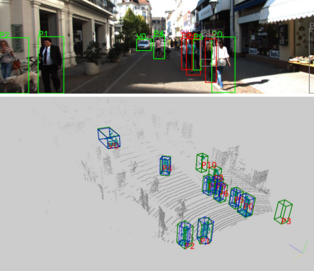

# OpenTraj
Trajectory Prediction Benchmark and State-of-the-art

## Public Available Trajectory Datasets

<!--begin(table_main)-->
| Sample | Name | Description | Ref | 
|----|----|----|----|
|  | [ETH](https://github.com/amiryanj/OpenTraj/blob/master/ETH) | 2 top view scenes <code>#Traj:[Peds=750]</code> <code>Coord=world</code> <code>FPS=2.5</code> | <a href='http://www.vision.ee.ethz.ch/en/datasets/'>[website]</a> <a href='https://ethz.ch/content/dam/ethz/special-interest/baug/igp/photogrammetry-remote-sensing-dam/documents/pdf/pellegrini09iccv.pdf'>[paper]</a> | 
|  | [UCY]() | 3 scenes (Zara/Arxiepiskopi/University). Zara and University close to top view. Arxiepiskopi more inclined. <code>#Traj:[Peds=786]</code> <code>Coord=world</code> <code>FPS=2.5</code> | <a href='https://graphics.cs.ucy.ac.cy/research/downloads/crowd-data'>[website]</a> <a href='https://onlinelibrary.wiley.com/doi/full/10.1111/j.1467-8659.2007.01089.x'>[paper]</a>  | 
|  | [SDD]() | 8 top view scenes <code>#Traj:[Bikes=4210 Peds=5232 Skates=292 Carts=174 Cars=316 Buss=76 Total=10,300]</code> <code>Coord=image</code> <code>FPS=30</code> | <a href='http://cvgl.stanford.edu/projects/uav_data'>[website]</a> <a href='http://svl.stanford.edu/assets/papers/ECCV16social.pdf'>[paper]</a>  | 
|  | GC | Grand Central Train Station Dataset: 1 scene of 33:20 minutes of crowd trajectories <code>#Traj:[Peds=12,684]</code> <code>Coord=image</code> <code>FPS=25</code> | <a href='https://www.dropbox.com/s/7y90xsxq0l0yv8d/cvpr2015_pedestrianWalkingPathDataset.rar'>[dropbox]</a> <a href='http://openaccess.thecvf.com/content_cvpr_2015/html/Yi_Understanding_Pedestrian_Behaviors_2015_CVP | 
|  | HERMES | Controlled Crowd Evacuation Experiments (Unidirectional and bidirectional flows) <code>#Traj:[0]</code> <code>Coord=0</code> <code>FPS=16</code> | <a href='https://zenodo.org/record/1054017#.XdZ-d3FKi90'>[website]</a>  | 
|  | Waymo | high-resolution sensor data collected by Waymo self-driving cars <code>#Traj:[0]</code> <code>Coord=2D and 3D</code> <code>FPS=?</code> | <a href='https://waymo.com/open/'>[website]</a> <a href='https://github.com/waymo-research/waymo-open-dataset'>[github]</a>  | 
|  | KITTI | 0 <code>#Traj:[0]</code> <code>Coord=image(3d) +Calib</code> <code>FPS=10</code> | <a href='http://www.cvlibs.net/datasets/kitti/'>[website]</a>  | 
|  | inD | Naturalistic Trajectories of Vehicles and Vulnerable Road Users Recorded at German Intersections <code>#Traj:[Vehicles= x Peds=x Bikes=x]</code> <code>Coord=0</code> <code>FPS=0</code> | <a href='https://www.ind-dataset.com/'>[website]</a>  | 
|  | TRAF | 0 <code>#Traj:[0]</code> <code>Coord=image</code> <code>FPS=10</code> | <a href='https://gamma.umd.edu/researchdirections/autonomousdriving/trafdataset/'>[website]</a> <a href='https://drive.google.com/drive/folders/1zKaeboslkqoLdTJbRMyQ0Y9JL3007LRr'>[gDrive]</a>  | 
|  | L-CAS | 0 <code>#Traj:[0]</code> <code>Coord=0</code> <code>FPS=0</code> | <a href='http://www.vision.ee.ethz.ch/en/datasets/'>[website]</a>  | 
|  | VIRAT | 0 <code>#Traj:[0]</code> <code>Coord=0</code> <code>FPS=0</code> | <a href='http://viratdata.org/'>[website]</a>  | 
|  | VRU | consists of pedestrian and cyclist trajectories, recorded at an urban intersection using cameras and LiDARs <code>#Traj:[peds=1068 Bikes=464]</code> <code>Coord=World (Meter)</code> <code>FPS=?</code> | <a href='https://www.th-ab.de/ueber-uns/organisation/labor/kooperative-automatisierte-verkehrssysteme/trajectory-dataset'>[website]</a>  | 
|  | highD | 0 <code>#Traj:[> 110,500 vehicles]</code> <code>Coord=0</code> <code>FPS=0</code> | <a href='https://www.highd-dataset.com/'>[website]</a>  | 
|  | Edinburgh | 0 <code>#Traj:[0]</code> <code>Coord=0</code> <code>FPS=0</code> | <a href='http://homepages.inf.ed.ac.uk/rbf/FORUMTRACKING/'>[website]</a>  | 
|  | Town Center | CCTV video of pedestrians in a busy downtown area in Oxford <code>#Traj:[peds=2,200]</code> <code>Coord=0</code> <code>FPS=0</code> | <a href='https://megapixels.cc/datasets/oxford_town_centre/'>[website]</a>  | 
|  | ZTD | ZEN Traffic Dataset: containing vehicle trajectories <code>#Traj:[Vehicles= x]</code> <code>Coord=World (Degree)</code> <code>FPS=10</code> | <a href='https://zen-traffic-data.net/english/outline/dataset.html'>[website]</a>  | 
|  | ATC | Pedestrian Tracking Dataset <code>Coord=Range sensor</code> | <a href='https://irc.atr.jp/crest2010_HRI/ATC_dataset'>[website]</a>  | 
|  | City Scapes | 25,000 annotated images (Semantic/ Instance-wise/ Dense pixel annotations) | <a href='https://www.cityscapes-dataset.com/dataset-overview/'>[website]</a>  | 
|  | Forking Paths Garden | **Multi-modal** _Synthetic_ dataset, created in a [CARLA](https://carla.org) (3D simulator) based on real world trajectory data, extrapolated by human annotators | <a href='https://next.cs.cmu.edu/multiverse/index.html'>[website]</a> <a href='https://github.com/JunweiLiang/Multiverse'>[github]</a> <a href='https://arxiv.org/abs/1912.06445'>[paper]</a>  | 
|  | nuScenes | Large-scale Autonomous Driving dataset <code>#Traj:[peds=222,164 vehicles=662,856]</code> <code>Coord=World + 3D Range Data</code> <code>FPS=2</code> | <a href='www.nuscences.org'>[website]</a>  | 
|  | Argoverse | 320 hours of Self-driving dataset <code>#Traj:[objects=11,052]</code> <code>Coord=3D</code> <code>FPS=10</code> | <a href='https://www.argoverse.org'>[website]</a>  | 

<!--end(table_main)-->

#### Other Datasets
- [NGSim](https://catalog.data.gov/dataset/next-generation-simulation-ngsim-vehicle-trajectories)
- [Daimler](http://www.gavrila.net/Datasets/Daimler_Pedestrian_Benchmark_D/daimler_pedestrian_benchmark_d.html)
- [ATC](No Link)
- [Cyclist](No Link)

#### Benchmarks
- [Trajnet](http://trajnet.stanford.edu/): Trajectory Forecasting Challenge
- [MOT-Challenge](https://motchallenge.net): Multiple Object Tracking Benchmark

## Tools
OpenTraj provids a set of tools to load, visualize and analyze the trajectory datasets. (So far few datasets are supported).
#### 1. Parser
Using python files in [parser](toolkit/parser) dir, you can load a dataset into a dataset object. This object then can be used to retrieve the trajectories, with different queries (by id, timestamp, ...).
#### 2. play.py
Using [play.py](toolkit/play.py) script you can visualize a specific dataset, in a basic graphical interface.

  

## Metrics
**1. ADE** (Tobs, Tpred):
Average Displacement Error (ADE), also called Mean Euclidean Distance (MED), measures the averages Euclidean distances between points of the predicted trajectory and the ground truth that have the same temporal distance from their respective start points. The function arguemnts are:
- Tobs : observation period
- Tpred : prediction period

**2. FDE** (Tobs, Tpred):
Final Displacement Error (FDE) measures the distance between final predicted position and the ground truth position at the corresponding time point. The function arguemnts are:
- Tobs : observation period
- Tpred : prediction period

## State-of-the-art Trajectory Prediction Algorithms
\* The numbers are derived from papers.
- [ ] setup benchmarking 
- [ ] update top 20 papers

#### 1. ETH Dataset

<!--begin(table_ETH)-->
| Method | Univ (ADE/FDE)* | Hotel (ADE/FDE)* | REF | 
|----|----|----|----|
| [Social-Force]() | 0.67 / 1.52 | 0.52 / 1.03 | 0 | 
| [Social-LSTM]() | 1.09 / 2.35 | 0.79 / 1.76 | 0 | 
| [Social-GAN](github.com/agrimgupta92/sgan) | 0.77 / 1.38 | 0.70 / 1.43 | 0 | 
| [Social-Ways](github.com/amiryanj/socialways) | 0.39 / 0.64 | 0.39 / 0.66 | 0 | 

<!--end(table_ETH)-->

`TBC`

<!-- 
| [Social-Attention]() [REF](#references)                                  | ?  | ?  |
| [SoPhie]() [REF]()                                            | ?  | ?  |
| [CIDNN](github.com/svip-lab/CIDNN) [REF]()            | ?  | ?  |
| [Social-Etiquette]() [REF]()            | ?  | ?  |
| [ConstVel]() [REF]()            | ?  | ?  |
| [Scene-LSTM]() [REF]()            | ?  | ?  |
| [Peeking Into the Future]() [REF]()            | ?  | ?  |
| [SS-LSTM]() [REF]()            | ?  | ?  |
| [MX-LSTM]() [REF]()            | ?  | ?  |
| [Social-BiGAT]() [REF]()            | ?  | ?  |
| [SR-LSTM]() [REF]()            | ?  | ?  |
-->

&ast; The values are in meter, calculated with ADE(Tobs=3.2s, Tpred=4.8s) and FDE(Tobs=3.2s, Tpred=4.8s).
<!--% Social Force => (https://ieeexplore.ieee.org/stamp/stamp.jsp?arnumber=5995468) -->
<!--% Social Attention => (https://www.ri.cmu.edu/wp-content/uploads/2018/08/main.pdf) -->

<!--
- [Social-Etiquette](https://infoscience.epfl.ch/record/230262/files/ECCV16social.pdf)
- [ConstVel(The simpler, the better)](https://arxiv.org/pdf/1903.07933)
- [Scene-LSTM](https://arxiv.org/pdf/1808.04018)
- [Peeking Into the Future](http://openaccess.thecvf.com/content_CVPR_2019/papers/Liang_Peeking_Into_the_Future_Predicting_Future_Person_Activities_and_Locations_CVPR_2019_paper.pdf)
- [SS-LSTM](https://ieeexplore.ieee.org/iel7/8345804/8354104/08354239.pdf)
- [MX-LSTM](http://openaccess.thecvf.com/content_cvpr_2018/papers/Hasan_MX-LSTM_Mixing_Tracklets_CVPR_2018_paper.pdf)
- [Social-BiGAT](http://papers.nips.cc/paper/8308-social-bigat-multimodal-trajectory-forecasting-using-bicycle-gan-and-graph-attention-networks.pdf)
- [SR-LSTM](http://openaccess.thecvf.com/content_CVPR_2019/papers/Zhang_SR-LSTM_State_Refinement_for_LSTM_Towards_Pedestrian_Trajectory_Prediction_CVPR_2019_paper.pdf)
-->

#### 2. UCY Dataset
`TBC`
<!--begin(table-UCY)-->
<!-- 
| Method                                              | ZARA01 (ADE/FDE) | ZARA02 (ADE/FDE) | Students (ADE/FDE) |
| ------------------------------------------------------------------------------ | -- | -- | -- |
| [Social-Force]() [1](#references)                                   | ?  | ?  | ?  |
| [Social-Etiquette]() [REF]()                                        | ?  | ?  | ?  |
| [Social-LSTM]() [2](#references)                                    | ?  | ?  | ?  |
| [Social-GAN](github.com/agrimgupta92/sgan) [REF](#references)       | ?  | ?  | ?  |
| [CIDNN](github.com/svip-lab/CIDNN) [REF]()                          | ?  | ?  | ?  |
| [Social-Attention]() [REF](#references)                             | ?  | ?  | ?  |
| [Scene-LSTM]() [REF]()                                              | ?  | ?  | ?  |
| [ConstVel]() [REF]()                                                | ?  | ?  | ?  |
| [SoPhie]() [REF]()                                                  | ?  | ?  | ?  |
| [Social-Ways](github.com/amiryanj/socialways) [REF](#references)    | ?  | ?  | ?  |
| [Peeking Into the Future]() [REF]()                                 | ?  | ?  | ?  |
| [SS-LSTM]() [REF]()                                                 | ?  | ?  | ?  |
| [Social-BiGAT]() [REF]()                                            | ?  | ?  | ?  |
| [SR-LSTM]() [REF]()                                                 | ?  | ?  | ?  |
-->
<!--end(table-UCY)-->
#### 3. Other Datasets
- Stanford Drone Dataset (SDD)

&nbsp;&nbsp;&nbsp;&nbsp;&nbsp;&nbsp; :small_blue_diamond: [Social-Etiquette](https://infoscience.epfl.ch/record/230262/files/ECCV16social.pdf)
&nbsp;&nbsp;&nbsp;&nbsp;&nbsp;&nbsp; :small_blue_diamond: [DESIRE](http://openaccess.thecvf.com/content_cvpr_2017/papers/Lee_DESIRE_Distant_Future_CVPR_2017_paper.pdf)
&nbsp;&nbsp;&nbsp;&nbsp;&nbsp;&nbsp; :small_blue_diamond: [SoPhie](http://openaccess.thecvf.com/content_CVPR_2019/papers/Sadeghian_SoPhie_An_Attentive_GAN_for_Predicting_Paths_Compliant_to_Social_CVPR_2019_paper.pdf)
&nbsp;&nbsp;&nbsp;&nbsp;&nbsp;&nbsp; :small_blue_diamond: [MATF](http://openaccess.thecvf.com/content_CVPR_2019/papers/Zhao_Multi-Agent_Tensor_Fusion_for_Contextual_Trajectory_Prediction_CVPR_2019_paper.pdf)
&nbsp;&nbsp;&nbsp;&nbsp;&nbsp;&nbsp; :small_blue_diamond: [Best of Many](http://openaccess.thecvf.com/content_cvpr_2018/papers/Bhattacharyya_Accurate_and_Diverse_CVPR_2018_paper.pdf)

- Grand Central Station (GC):

&nbsp;&nbsp;&nbsp;&nbsp;&nbsp;&nbsp; :small_blue_diamond: [CIDNN](http://openaccess.thecvf.com/content_cvpr_2018/papers/Xu_Encoding_Crowd_Interaction_CVPR_2018_paper.pdf)

- KITI

&nbsp;&nbsp;&nbsp;&nbsp;&nbsp;&nbsp; :small_blue_diamond: [R2P2](http://openaccess.thecvf.com/content_ECCV_2018/papers/Nicholas_Rhinehart_R2P2_A_ReparameteRized_ECCV_2018_paper.pdf)

## Collaboration
Are you interested in collaboration on OpenTraj? Send an email to [me](mailto:amiryan.j@gmail.com?subject=OpenTraj) titled *OpenTraj*.

## References
#### (A) Main References:
- Who are you with and Where are you going? (Social Force), Yamaguchi et al. CVPR 2011. [paper]()
- Social LSTM: Human trajectory prediction in crowded spaces, Alahi et al. CVPR 2016. [paepr]()
- Learning social etiquette: Human trajectory understanding in crowded scenes, Robicquet et al. ECCV 2016. [paper](https://infoscience.epfl.ch/record/230262/files/ECCV16social.pdf) 
- Social GAN: Socially Acceptable Trajectories with Generative Adversarial Networks, Gupta et al. CVPR 2018. [paper]()
- Social Ways: Learning Multi-Modal Distributions of Pedestrian Trajectories with GANs, Amirian et al. CVPR 2019. [paper](), [code]()

** A more complete list of references can be found [here](https://github.com/jiachenli94/Awesome-Interaction-aware-Trajectory-Prediction)
<!--
- Desire: Distant future prediction in dynamic scenes with interacting agents, Lee et al. CVPR 2017. [paper](http://openaccess.thecvf.com/content_cvpr_2017/papers/Lee_DESIRE_Distant_Future_CVPR_2017_paper.pdf)
- Sophie: An attentive gan for predicting paths compliant to social and physical constraints, Sadeghian et al. CVPR 2019. [paper](https://arxiv.org/pdf/1806.01482.pdf)
- [MATF (Multi-Agent Tensor Fusion)](http://openaccess.thecvf.com/content_CVPR_2019/papers/Zhao_Multi-Agent_Tensor_Fusion_for_Contextual_Trajectory_Prediction_CVPR_2019_paper.pdf)
- [Best of Many](http://openaccess.thecvf.com/content_cvpr_2018/papers/Bhattacharyya_Accurate_and_Diverse_CVPR_2018_paper.pdf)
-->

#### (B) Surveys:
&ast; ordered by time
- A Survey on Path Prediction Techniques for Vulnerable Road Users: From Traditional to Deep-Learning Approaches, ITSC 2019. [paper](https://ieeexplore.ieee.org/abstract/document/8917053)
- Human Motion Trajectory Prediction: A Survey, IJRR 2019 [arxiv](https://arxiv.org/abs/1905.06113)
- Autonomous vehicles that interact with pedestrians: A survey of theory and practice, ITS 2019. [arxiv](https://arxiv.org/abs/1805.11773)
- A literature review on the prediction of pedestrian behavior in urban scenarios, ITSC 2018. [paper](https://ieeexplore.ieee.org/abstract/document/8569415)
- Survey on Vision-Based Path Prediction, DAPI 2018. [arxiv](https://arxiv.org/abs/1811.00233)
- Trajectory data mining: an overview, TIST 2015. [paper](https://www.microsoft.com/en-us/research/wp-content/uploads/2015/09/TrajectoryDataMining-tist-yuzheng.pdf)
- A survey on motion prediction and risk assessment for intelligent vehicles, ROBOMECH 2014. [paper](https://core.ac.uk/download/pdf/81530180.pdf)

