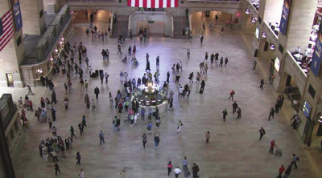

# OpenTraj
Trajectory Prediction Benchmark and State-of-the-art

## Table of Public Available Trajectory Datasets

| Sample	                           | Name |	\#Trajs | Coord | FPS |	Density |	\*\*\*\*\*\*Description\*\*\*\*\*\* |	REF |
| ---------------------------------- | ---- | -------- | ----- | --- | -------- | ----- | ---- |
|      | ETH  | 750      | world | 2.5 | ?        |       | [website](http://www.vision.ee.ethz.ch/~stefpell/lta/index.html) [paper](https://ethz.ch/content/dam/ethz/special-interest/baug/igp/photogrammetry-remote-sensing-dam/documents/pdf/pellegrini09iccv.pdf)| 
|  | UCY  | 786      | world | 2.5 | ?        |       | [website](https://graphics.cs.ucy.ac.cy/research/downloads/crowd-data) [paper](https://onlinelibrary.wiley.com/doi/full/10.1111/j.1467-8659.2007.01089.x)| 
| | SDD  | Bikes=4210 Peds=5232 Skates=292 Carts=174 Cars=316 Buss=76 total=10,300 | image |     | ?        |       | [website](http://cvgl.stanford.edu/projects/uav_data) [paper](http://svl.stanford.edu/assets/papers/ECCV16social.pdf)|
|               | GC   | 12,684   | image |     | ?        |       | [dropbox](https://www.dropbox.com/s/7y90xsxq0l0yv8d/cvpr2015_pedestrianWalkingPathDataset.rar) [paper](http://openaccess.thecvf.com/content_cvpr_2015/html/Yi_Understanding_Pedestrian_Behaviors_2015_CVPR_paper.html)|

- [Waymo](https://waymo.com/open/)
- [KITTI](http://www.cvlibs.net/datasets/kitti/)
- [TRAF](https://gamma.umd.edu/researchdirections/autonomousdriving/trafdataset/)
- [ZID](https://zen-traffic-data.net/english/outline/dataset.html)
- [VRU](https://www.th-ab.de/ueber-uns/organisation/labor/kooperative-automatisierte-verkehrssysteme/trajectory-dataset)
- [Bottleneck(Seyfried)](https://zenodo.org/record/1054017#.XdZ-d3FKi90)
- [InD](https://www.highd-dataset.com/)
- [highD](https://www.highd-dataset.com/)
- [VIRAT](http://viratdata.org/)
- [Edinburg](http://homepages.inf.ed.ac.uk/rbf/FORUMTRACKING/)
- [Daimler](http://www.gavrila.net/Datasets/Daimler_Pedestrian_Benchmark_D/daimler_pedestrian_benchmark_d.html)
- [Town Center](https://megapixels.cc/datasets/oxford_town_centre/)
- [L-CAS](https://lcas.lincoln.ac.uk/wp/research/data-sets-software/l-cas-3d-point-cloud-people-dataset/)
- [NGSim](https://catalog.data.gov/dataset/next-generation-simulation-ngsim-vehicle-trajectories)
- [ATC](No Link)
- [Cyclist](No Link)

## Metrics
**1. ADE** _[To, Tp]_

**2. FDE** _[To, Tp]_

**3. Correspondence to Scene (CS)**

## State-of-the-arts Trajectory Prediction Algorithms
#### 1. ETH Dataset
| Method	                                                    | Univ (ADE*/FDE*) |	Hotel (ADE/FDE) |
| ------------------------------------------------------------------------ | -- | -- |
| [Social-Force]() [REF]()                                      | ?  | ?  |
| [Social-LSTM]() [REF]()                                       | ?  | ?  |
| [Social-GAN](https://github.com/agrimgupta92/sgan) [REF]()    | ?  | ?  |
| [Social-Ways](https://github.com/amiryanj/socialways) [REF]() | ?  | ?  |
| [Social-Attention]() [REF]()                                  | ?  | ?  |
| [SoPhie]() [REF]()                                            | ?  | ?  |
| [CIDNN](https://github.com/svip-lab/CIDNN) [REF]()            | ?  | ?  |

<!--% Social Force => (https://ieeexplore.ieee.org/stamp/stamp.jsp?arnumber=5995468) -->
<!--% Social Attention => (https://www.ri.cmu.edu/wp-content/uploads/2018/08/main.pdf) -->

- [Social-Etiquette](https://infoscience.epfl.ch/record/230262/files/ECCV16social.pdf)
- [ConstVel(The simpler, the better)](https://arxiv.org/pdf/1903.07933)
- [Scene-LSTM](https://arxiv.org/pdf/1808.04018)
- [Peeking Into the Future](http://openaccess.thecvf.com/content_CVPR_2019/papers/Liang_Peeking_Into_the_Future_Predicting_Future_Person_Activities_and_Locations_CVPR_2019_paper.pdf)
- [SS-LSTM](https://ieeexplore.ieee.org/iel7/8345804/8354104/08354239.pdf)
- [MX-LSTM](http://openaccess.thecvf.com/content_cvpr_2018/papers/Hasan_MX-LSTM_Mixing_Tracklets_CVPR_2018_paper.pdf)
- [Social-BiGAT](http://papers.nips.cc/paper/8308-social-bigat-multimodal-trajectory-forecasting-using-bicycle-gan-and-graph-attention-networks.pdf)
- [SR-LSTM](http://openaccess.thecvf.com/content_CVPR_2019/papers/Zhang_SR-LSTM_State_Refinement_for_LSTM_Towards_Pedestrian_Trajectory_Prediction_CVPR_2019_paper.pdf)

#### 2. UCY Dataset
| Method                                              | ZARA01 (ADE/FDE) | ZARA02 (ADE/FDE) | Students (ADE/FDE) |
| ------------------------------------------------------------------------ | -- | -- | -- |
| [Social-LSTM]() [REF]()                                       | ?  | ?  | ?  |
| [Social-GAN](https://github.com/agrimgupta92/sgan) [REF]()    | ?  | ?  | ?  |
| [Social-Ways](https://github.com/amiryanj/socialways) [REF]() | ?  | ?  | ?  |
| [SoPhie]() [REF]()                                            | ?  | ?  | ?  |
| [CIDNN](https://github.com/svip-lab/CIDNN) [REF]()            | ?  | ?  | ?  |

#### 3. Stanford Drone Dataset (SDD)
- [Social-Etiquette](https://infoscience.epfl.ch/record/230262/files/ECCV16social.pdf)
- [DESIRE](http://openaccess.thecvf.com/content_cvpr_2017/papers/Lee_DESIRE_Distant_Future_CVPR_2017_paper.pdf)
- [SoPhie](http://openaccess.thecvf.com/content_CVPR_2019/papers/Sadeghian_SoPhie_An_Attentive_GAN_for_Predicting_Paths_Compliant_to_Social_CVPR_2019_paper.pdf)
- [MATF (Multi-Agent Tensor Fusion)](http://openaccess.thecvf.com/content_CVPR_2019/papers/Zhao_Multi-Agent_Tensor_Fusion_for_Contextual_Trajectory_Prediction_CVPR_2019_paper.pdf)
- [Best of Many](http://openaccess.thecvf.com/content_cvpr_2018/papers/Bhattacharyya_Accurate_and_Diverse_CVPR_2018_paper.pdf)

#### 4. Grand Central Station (GC) Dataset
- [CIDNN](http://openaccess.thecvf.com/content_cvpr_2018/papers/Xu_Encoding_Crowd_Interaction_CVPR_2018_paper.pdf)

#### 5. KITI
- [R2P2](http://openaccess.thecvf.com/content_ECCV_2018/papers/Nicholas_Rhinehart_R2P2_A_ReparameteRized_ECCV_2018_paper.pdf)

## References
1. MOT Challenge
2. Trajnet

