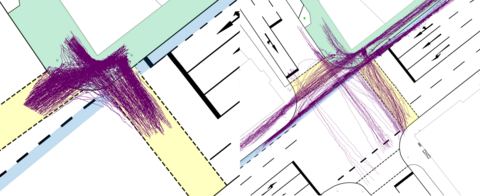
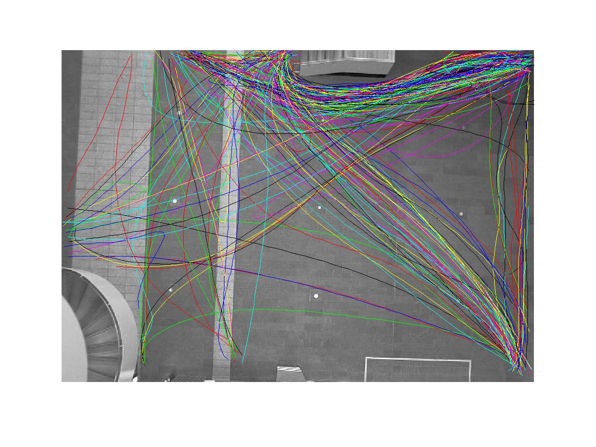
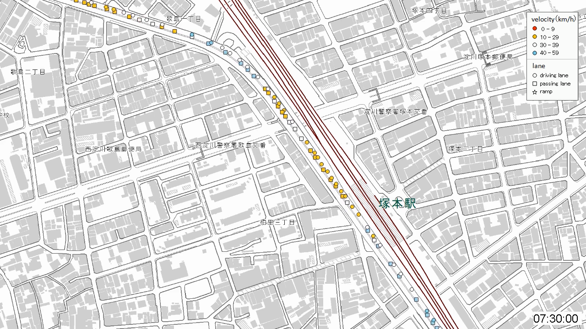

# OpenTraj
Trajectory Prediction Benchmark and State-of-the-art

## Table of Public Available Trajectory Datasets

| Sample	                           | Name |	\#Trajs | Coord | FPS |	Density |	\*\*\*\*\*\*Description\*\*\*\*\*\* |	REF |
| ---------------------------------- | ---- | -------- | ----- | --- | -------- | ----- | ------- |
|      | [ETH](ETH)  | Peds=750      | world | 2.5 | ?        | 2 top view scenes      | [[website]](http://www.vision.ee.ethz.ch/en/datasets/) [[paper]](https://ethz.ch/content/dam/ethz/special-interest/baug/igp/photogrammetry-remote-sensing-dam/documents/pdf/pellegrini09iccv.pdf)| 
|  | [UCY](UCY)  | Peds=786      | world | 2.5 | ?        |   3 scenes (Zara/Arxiepiskopi/University). Zara and University close to top view. Arxiepiskopi more inclined.    | [[website]](https://graphics.cs.ucy.ac.cy/research/downloads/crowd-data) [paper](https://onlinelibrary.wiley.com/doi/full/10.1111/j.1467-8659.2007.01089.x)| 
| | [SDD](SDD)  | Bikes=4210 Peds=5232 Skates=292 Carts=174 Cars=316 Buss=76 Total=10,300 | image | 30 | ?        | 8 top view scenes      | [[website]](http://cvgl.stanford.edu/projects/uav_data) [[paper]](http://svl.stanford.edu/assets/papers/ECCV16social.pdf)|
|               | [GC](GC)   | Peds=12,684   | image | 25   | ?        |  1 scene  | [[dropbox]](https://www.dropbox.com/s/7y90xsxq0l0yv8d/cvpr2015_pedestrianWalkingPathDataset.rar) [[paper]](http://openaccess.thecvf.com/content_cvpr_2015/html/Yi_Understanding_Pedestrian_Behaviors_2015_CVPR_paper.html)|
|           | [Waymo](Waymo) |         |  | ? | ? |  | [website](https://waymo.com/open/) [github](https://github.com/waymo-research/waymo-open-dataset)|
|           | [KITTI](KITTI) |         | image(3d) +Calib | 10 | ? |  | [website](http://www.cvlibs.net/datasets/kitti/)|
|   | [HERMES](HERMES)  |       |  |  | ?        |      | [website](https://zenodo.org/record/1054017#.XdZ-d3FKi90)|
|      | [highD](highD)  | > 110,500 vehicles      |  |  | ?        |      | [website](https://www.highd-dataset.com/)|
|      | [inD](inD)  |  Vehicles= x Peds=x Bikes=x |  |  | ?        |      | [website](https://www.ind-dataset.com/)|
|           | [TRAF](TRAF) |         | image | 10 | ? |  | [website](https://gamma.umd.edu/researchdirections/autonomousdriving/trafdataset/) [gDrive](https://drive.google.com/drive/folders/1zKaeboslkqoLdTJbRMyQ0Y9JL3007LRr)|
|      | [L-CAS](L-CAS)  |       |  |  | ?        |      | [website](http://www.vision.ee.ethz.ch/en/datasets/)|
|      | [VIRAT](VIRAT)  |       |  |  | ?        |      | [website](http://viratdata.org/)|
|  |  [VRU](VRU) | peds=1068 Bikes=464  | World (Meter) | ? | ? | consists of pedestrian and cyclist trajectories, recorded at an urban intersection using cameras and LiDARs | [website](https://www.th-ab.de/ueber-uns/organisation/labor/kooperative-automatisierte-verkehrssysteme/trajectory-dataset) |
|      | [Edinburgh](Edinburgh)  |       |  |  | ?        |      | [website](http://homepages.inf.ed.ac.uk/rbf/FORUMTRACKING/)|
|      | [Town Center](Town-Center)  |      |  |  | ?        |   1 scene | [website](https://megapixels.cc/datasets/oxford_town_centre/)|
|           | [ZTD](ZTD) | Vehicles= x   | World (Degree) | 10 | ? | ZEN Traffic Dataset: containing vehicle trajectories | [website](https://zen-traffic-data.net/english/outline/dataset.html)|

<!-- - [Waymo](https://waymo.com/open/)  -->
<!-- - [KITTI](http://www.cvlibs.net/datasets/kitti/) -->
<!-- - [TRAF](https://gamma.umd.edu/researchdirections/autonomousdriving/trafdataset/) -->
<!-- - [ZTD](https://zen-traffic-data.net/english/outline/dataset.html) -->
<!-- - [VRU](https://www.th-ab.de/ueber-uns/organisation/labor/kooperative-automatisierte-verkehrssysteme/trajectory-dataset) -->
<!-- - [L-CAS](https://lcas.lincoln.ac.uk/wp/research/data-sets-software/l-cas-3d-point-cloud-people-dataset/) -->
<!-- - [highD](https://www.highd-dataset.com/) -->
<!-- - [InD](https://www.highd-dataset.com/) -->

<!-- - [HERMES(Seyfried)](https://zenodo.org/record/1054017#.XdZ-d3FKi90)  -->
<!-- - [VIRAT](http://viratdata.org/)  -->
<!-- - [Edinburg](http://homepages.inf.ed.ac.uk/rbf/FORUMTRACKING/)  -->
<!-- - [Town Center](https://megapixels.cc/datasets/oxford_town_centre/) -->

### Other Datasets
- [NGSim](https://catalog.data.gov/dataset/next-generation-simulation-ngsim-vehicle-trajectories)
- [Daimler](http://www.gavrila.net/Datasets/Daimler_Pedestrian_Benchmark_D/daimler_pedestrian_benchmark_d.html)
- [ATC](No Link)
- [Cyclist](No Link)

### Benchmarks
- [Trajnet](http://trajnet.stanford.edu/): Trajectory Forecasting Challenge
- [MOT-Challenge](https://motchallenge.net): Multiple Object Tracking Benchmark

## Metrics
**1. ADE** (Tobs, Tpred):
Average Displacement Error (ADE), also called Mean Euclidean Distance (MED), measures the averages Euclidean distances between points of the predicted trajectory and the ground truth that have the same temporal distance from their respective start points. The function arguemnts are:
- Tobs : observation period
- Tpred : prediction period

**2. FDE** (Tobs, Tpred):
Final Displacement Error (FDE) measures the distance between final predicted position and the ground truth position at the corresponding time point. The function arguemnts are:
- Tobs : observation period
- Tpred : prediction period

## State-of-the-arts Trajectory Prediction Algorithms
#### 1. ETH Dataset
| Method	                                                    | Univ (ADE/FDE)* |	Hotel (ADE/FDE)* |
| ------------------------------------------------------------------------ | -- | -- |
| [Social-Force]() [1](#references)                                      | ?  | ?  |
| [Social-LSTM]() [2](#references)                                       | ?  | ?  |
| [Social-GAN](github.com/agrimgupta92/sgan) [REF](#references)    | ?  | ?  |
| [Social-Ways](github.com/amiryanj/socialways) [REF](#references) | ?  | ?  |
| [Social-Attention]() [REF](#references)                                  | ?  | ?  |
| [SoPhie]() [REF]()                                            | ?  | ?  |
| [CIDNN](github.com/svip-lab/CIDNN) [REF]()            | ?  | ?  |
| [Social-Etiquette]() [REF]()            | ?  | ?  |
| [ConstVel]() [REF]()            | ?  | ?  |
| [Scene-LSTM]() [REF]()            | ?  | ?  |
| [Peeking Into the Future]() [REF]()            | ?  | ?  |
| [SS-LSTM]() [REF]()            | ?  | ?  |
| [MX-LSTM]() [REF]()            | ?  | ?  |
| [Social-BiGAT]() [REF]()            | ?  | ?  |
| [SR-LSTM]() [REF]()            | ?  | ?  |

&ast; The values are in meter, calculated with ADE(Tobs=3.2s, Tpred=4.8s)
<!--% Social Force => (https://ieeexplore.ieee.org/stamp/stamp.jsp?arnumber=5995468) -->
<!--% Social Attention => (https://www.ri.cmu.edu/wp-content/uploads/2018/08/main.pdf) -->

<!--
- [Social-Etiquette](https://infoscience.epfl.ch/record/230262/files/ECCV16social.pdf)
- [ConstVel(The simpler, the better)](https://arxiv.org/pdf/1903.07933)
- [Scene-LSTM](https://arxiv.org/pdf/1808.04018)
- [Peeking Into the Future](http://openaccess.thecvf.com/content_CVPR_2019/papers/Liang_Peeking_Into_the_Future_Predicting_Future_Person_Activities_and_Locations_CVPR_2019_paper.pdf)
- [SS-LSTM](https://ieeexplore.ieee.org/iel7/8345804/8354104/08354239.pdf)
- [MX-LSTM](http://openaccess.thecvf.com/content_cvpr_2018/papers/Hasan_MX-LSTM_Mixing_Tracklets_CVPR_2018_paper.pdf)
- [Social-BiGAT](http://papers.nips.cc/paper/8308-social-bigat-multimodal-trajectory-forecasting-using-bicycle-gan-and-graph-attention-networks.pdf)
- [SR-LSTM](http://openaccess.thecvf.com/content_CVPR_2019/papers/Zhang_SR-LSTM_State_Refinement_for_LSTM_Towards_Pedestrian_Trajectory_Prediction_CVPR_2019_paper.pdf)
-->

#### 2. UCY Dataset
| Method                                              | ZARA01 (ADE/FDE) | ZARA02 (ADE/FDE) | Students (ADE/FDE) |
| ------------------------------------------------------------------------ | -- | -- | -- |
| [Social-Force]() [1](#references)                                      | ?  | ?  | ? |
| [Social-LSTM]() [2](#references)                                       | ?  | ?  | ? |
| [Social-GAN](github.com/agrimgupta92/sgan) [REF](#references)    | ?  | ?  | ? |
| [Social-Ways](github.com/amiryanj/socialways) [REF](#references) | ?  | ?  | ? |
| [Social-Attention]() [REF](#references)                                  | ?  | ?  | ? |
| [SoPhie]() [REF]()                                            | ?  | ?  | ? |
| [CIDNN](github.com/svip-lab/CIDNN) [REF]()            | ?  | ?  | ? |
| [Social-Etiquette]() [REF]()            | ?  | ?  | ? |
| [ConstVel]() [REF]()            | ?  | ?  | ? |
| [Scene-LSTM]() [REF]()            | ?  | ?  | ? |
| [Peeking Into the Future]() [REF]()            |  ? | ?  | ?  |
| [SS-LSTM]() [REF]()            | ?  | ?  | ? |
| [MX-LSTM]() [REF]()            | ?  | ?  | ? |
| [Social-BiGAT]() [REF]()            | ?  | ?  |  ? |
| [SR-LSTM]() [REF]()            | ?  | ?  |  ? |

#### 3. Stanford Drone Dataset (SDD)
- [Social-Etiquette](https://infoscience.epfl.ch/record/230262/files/ECCV16social.pdf)
- [DESIRE](http://openaccess.thecvf.com/content_cvpr_2017/papers/Lee_DESIRE_Distant_Future_CVPR_2017_paper.pdf)
- [SoPhie](http://openaccess.thecvf.com/content_CVPR_2019/papers/Sadeghian_SoPhie_An_Attentive_GAN_for_Predicting_Paths_Compliant_to_Social_CVPR_2019_paper.pdf)
- [MATF (Multi-Agent Tensor Fusion)](http://openaccess.thecvf.com/content_CVPR_2019/papers/Zhao_Multi-Agent_Tensor_Fusion_for_Contextual_Trajectory_Prediction_CVPR_2019_paper.pdf)
- [Best of Many](http://openaccess.thecvf.com/content_cvpr_2018/papers/Bhattacharyya_Accurate_and_Diverse_CVPR_2018_paper.pdf)

#### 4. Grand Central Station (GC) Dataset
- [CIDNN](http://openaccess.thecvf.com/content_cvpr_2018/papers/Xu_Encoding_Crowd_Interaction_CVPR_2018_paper.pdf)

#### 5. KITI
- [R2P2](http://openaccess.thecvf.com/content_ECCV_2018/papers/Nicholas_Rhinehart_R2P2_A_ReparameteRized_ECCV_2018_paper.pdf)

## References
1. (Social Force)
2. Social LSTM: Human trajectory prediction in crowded spaces, CVPR 2016.
3. Social GAN: 
4. Social Ways: Social Ways: Learning Multi-Modal Distributions of Pedestrian Trajectories with GANs, CVPR 2019. [Precognition Workshop], [paper], [code]

### Surveys
1. A Survey on Path Prediction Techniques for Vulnerable Road Users: From Traditional to Deep-Learning Approaches, ITSC 2019. [paper](https://ieeexplore.ieee.org/abstract/document/8917053)
2. Human Motion Trajectory Prediction: A Survey, IJRR 2019 [arxiv](https://arxiv.org/abs/1905.06113)
3. Autonomous vehicles that interact with pedestrians: A survey of theory and practice, ITS 2019. [arxiv](https://arxiv.org/abs/1805.11773)
4. A literature review on the prediction of pedestrian behavior in urban scenarios, ITSC 2018. [paper](https://ieeexplore.ieee.org/abstract/document/8569415)
5. Survey on Vision-Based Path Prediction, DAPI 2018. [arxiv](https://arxiv.org/abs/1811.00233)
6. Trajectory data mining: an overview, TIST 2015. [paper](https://www.microsoft.com/en-us/research/wp-content/uploads/2015/09/TrajectoryDataMining-tist-yuzheng.pdf)
7. A survey on motion prediction and risk assessment for intelligent vehicles, ROBOMECH 2014. [paper](https://core.ac.uk/download/pdf/81530180.pdf)

