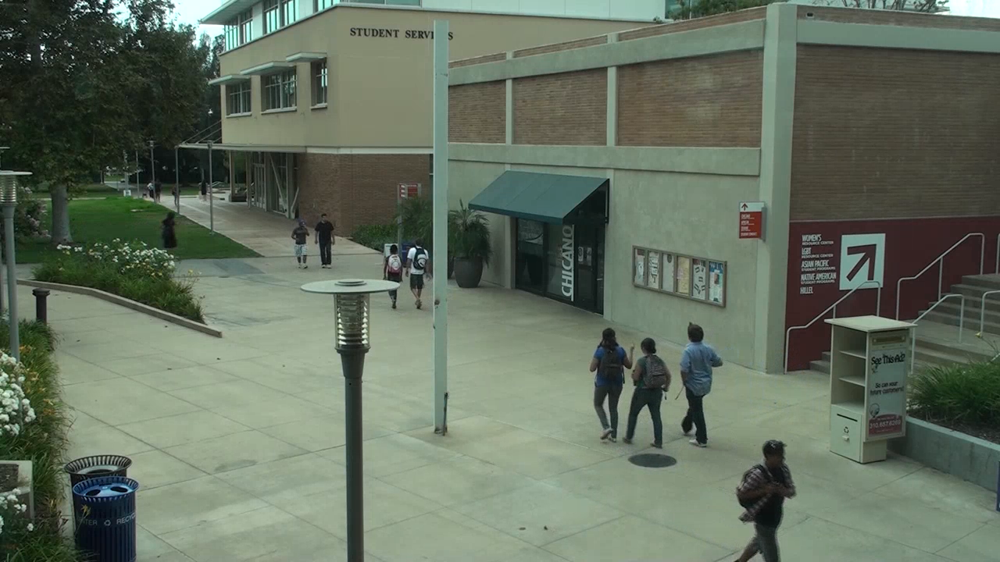

# The VIRAT Video Dataset
The VIRAT Video Dataset is designed to be realistic, natural and challenging for video surveillance domains in terms of its resolution, background clutter, diversity in scenes, and human activity/event categories than existing action recognition datasets. It has become a benchmark dataset for the computer vision community.

## ABOUT THE VIRAT VIDEO DATASET
The VIRAT video dataset distinguishes itself on the following characteristics.

**Realism and natural scenes**: Data was collected in natural scenes showing people performing normal actions in standard contexts, with uncontrolled, cluttered backgrounds. There are frequent incidental movers and background activities. Actions performed by directed actors were minimized; most were actions performed by the general population.

Diversity: Data was collected at multiple sites distributed throughout the USA. A variety of camera viewpoints and resolutions were included, and actions are performed by many different people.

Quantity: Diverse types of human actions and human-vehicle interactions are included, with a large number of examples (>30) per action class.

Wide range of resolution and frame rates: Many applications such as video surveillance operate across a wide range of spatial and temporal resolutions. The dataset is designed to capture these ranges, with 2–30Hz frame rates and 10–200 pixels in person-height. The dataset provides both the original videos with HD quality and downsampled versions both spatially and temporally.

Ground and Aerial Videos: Both ground camera videos and aerial videos are collected released as part of VIRAT Video Dataset.

The VIRAT Video Dataset contains two broad categories of activities (single-object and two-objects) which involve both human and vehicles. Details of included activities, and annotation formats may differ per release. Relevant information can be found from each release information.

Additional Data and Annotations
The large-scale Multiview Extended Video with Activities (MEVA) dataset features more than 250 hours of ground camera video, with additional resources such as UAV video, camera models, and a subset of 12.5 hours of annotated data. The dataset is designed for activity detection in multi-camera environments. It was created on the Intelligence Advanced Research Projects Activity (IARPA) Deep Intermodal Video Analytics (DIVA) program to support DIVA performers and the broader research community. The dataset and annotations are available at the mevadata.org site.

Release News
December 29, 2016: Aerial annotations status: Annotating the aerial video proved extremely challenging, and we were unable to complete the annotations on the original contract. We are actively pursuing promising funding opportunities and hope to have an update soon.

2012 Jan 11th: Version 2.0 of the VIRAT Public Dataset is updated with Aerial video subsets. Currently, only videos are available.

2011 Oct 4th: Version 2.0 of the VIRAT Public Dataset is released with Ground video subsets. All videos, totalling ~8.5 hours of HD data, are Stationary Ground Videos. The annotations are for 12 event types, annotated in videos from 11 different outdoor scenes. The release also includes suggested evaluation metrics and methodologies (data folds for cross-validation etc.)

Release 2.0 is described in a PDF available [here](https://data.kitware.com/api/v1/file/56f581c88d777f753209c9ce/download).
