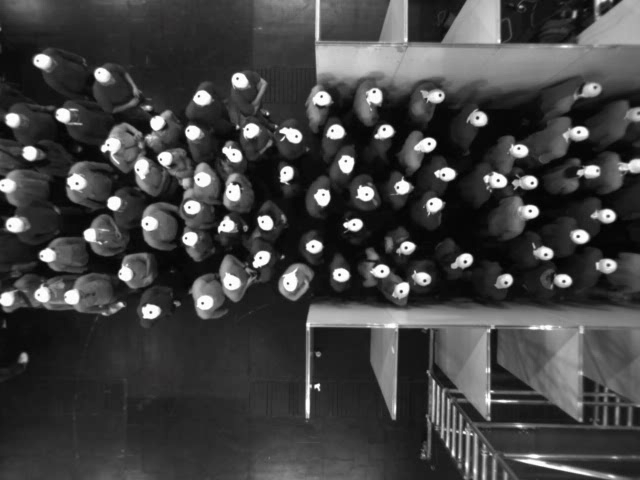

# HERMES (Pedestrian Dynamics) Dataset
This data archive of experiments studying the dynamics of pedestrians is build up by the Institute for Advanced Simulation 7:[Civil Safety Research](http://www.fz-juelich.de/ias/ias-7) of [Forschungszentrum Jülich](http://www.fz-juelich.de/portal/EN/Home/home_node.html).
The experiments were performed under laboratory conditions to focus on the influence of a single variable.

<p align='center'>
    
</p>

- The data are part of the online database http://ped.fz-juelich.de/database.

## Detail of Experiments
* Corridor data are trajectories of pedestrians in a closed corridor of lenght 30m and width 1.8m. 
* The trajectories are measured on a section of length 6m. 
* Experiments are carried out with N=15, 30, 60, 85, 95, 110, 140 and 230 participants. 
* Bottleneck data are trajectories of pedestrian in a bottleneck of lenght 8m and width 1.8m. 
* Experiments are carried out with 150 participants for bottleneck widths w=0.7, 0.95 1.2 and 1.8m. 

** Column names of the file are: **
```python
ID FRAME X Y Z. 
- ID: the pedestrian index. 
- FRAME: the frame number (frame rate is 1/16s). 
- X Y and Z: pedestrian position in 3d. 
```

- See http://ped.fz-juelich.de/experiments/2009.05.12_Duesseldorf_Messe_Hermes/docu/VersuchsdokumentationHERMES.pdf page 20 and 28 for details. 

### Uni-directional Flow Experiments
<!--- table generated using tablesgenerator.com/ --->

<p align='center'>
    
</p>

| Name           	| b<sub>entrance</sub>(m) | b<sub>corridor</sub>(m) | b<sub>exit</sub>(m)	| N<sub>ped</sub> 	|
|----------------	|------------	|------------	|--------	|-------	|
| uo-050-180-180 	| 0.50       	| 1.80       	| 1.80   	| 61    	|
| uo-060-180-180 	| 0.60       	| 1.80       	| 1.80   	| 66    	|
| uo-070-180-180 	| 0.70       	| 1.80       	| 1.80   	| 111   	|
| uo-100-180-180 	| 1.00       	| 1.80       	| 1.80   	| 121   	|
| uo-145-180-180 	| 1.45       	| 1.80       	| 1.80   	| 175   	|
| uo-180-180-180 	| 1.80       	| 1.80       	| 1.80   	| 220   	|
| uo-180-180-120 	| 1.80       	| 1.80       	| 1.20   	| 170   	|
| uo-180-180-095 	| 1.80       	| 1.80       	| 0.95   	| 159   	|
| uo-180-180-070 	| 1.80       	| 1.80       	| 0.70   	| 148   	|
| uo-065-240-240 	| 0.65       	| 2.40       	| 2.40   	| 70    	|
| uo-080-240-240 	| 0.80       	| 2.40       	| 2.40   	| 118   	|
| uo-095-240-240 	| 0.95       	| 2.40       	| 2.40   	| 108   	|
| uo-145-240-240 	| 1.45       	| 2.40       	| 2.40   	| 155   	|
| uo-190-240-240 	| 1.90       	| 2.40       	| 2.40   	| 218   	|
| uo-240-240-240 	| 2.40       	| 2.40       	| 2.40   	| 246   	|
| uo-240-240-160 	| 2.40       	| 2.40       	| 1.60   	| 276   	|
| uo-240-240-130 	| 2.40       	| 2.40       	| 1.30   	| 247   	|
| uo-240-240-100 	| 2.40       	| 2.40       	| 1.00   	| 254   	|
| uo-080-300-300 	| 0.80       	| 3.00       	| 3.00   	| 119   	|
| uo-100-300-300 	| 1.00       	| 3.00       	| 3.00   	| 100   	|
| uo-120-300-300 	| 1.20       	| 3.00       	| 3.00   	| 163   	|
| uo-180-300-300 	| 1.80       	| 3.00       	| 3.00   	| 208   	|
| uo-240-300-300 	| 2.40       	| 3.00       	| 3.00   	| 296   	|
| uo-300-300-300 	| 3.00       	| 3.00       	| 3.00   	| 349   	|
| uo-300-300-200 	| 3.00       	| 3.00       	| 2.00   	| 351   	|
| uo-300-300-160 	| 3.00       	| 3.00       	| 1.60   	| 349   	|
| uo-300-300-120 	| 3.00       	| 3.00       	| 1.20   	| 348   	|
| uo-300-300-080 	| 3.00       	| 3.00       	| 0.80   	| 270   	|

### Bi-directional Flow Experiments

<p align='center'>
    
</p>

| Name | b<sub>enter</sub>(L) | b<sub>corridor</sub>(m) | b<sub>enter</sub>(R) | N<sub>ped</sub>(L)/N<sub>ped</sub>(R) | Duration | Desc. |
|---------------- | :-------: | :-------: | :-------: | :-------: | :-------: | :-------: |
|BO-360-050-050 | 0,50 | 3,6 | 0,50 | 50/50 | 0:59 | free |
|BO-360-075-075 | 0,75 | 3,6 | 0,75 | 50/50 | 1:09 | free |
|BO-360-090-090 | 0,90 | 3,6 | 0,90 | 100/100 | 1:04 | free |
|BO-360-120-120 | 1,20 | 3,6 | 1,20 | 100/100 | 1:21 | free |
|BO-360-160-160 | 1,60 | 3,6 | 1,60 | 150/150 | 1:21 | free |
|BOA-300-050-070 | 0,50 | 3,0 | 0,70 | 50/50 | 1:13 | asymmetrisch |
|BOA-300-050-085 | 0,50 | 3,0 | 0,85 | 50/50 | 1:08 | asymmetrisch |
|BOA-300-055-095 | 0,55 | 3,0 | 0,95 | 50/50 | 0:52 | asymmetrisch |
|BOA-300-065-105 | 0,65 | 3,0 | 1,05 | 100/100 | 1:29 | asymmetrisch |
|BOA-300-080-120 | 0,80 | 3,0 | 1,20 | 100/100 | 1:13 | asymmetrisch |
|BOT-300-050-050 | 0,50 | 3,0 | 0,50 | X/X | x | symmetrisch |
|BOT-300-065-065 | 0,65 | 3,0 | 0,65 | X/X | x | symmetrisch |
|BOT-300-075-075 | 0,75 | 3,0 | 0,75 | X/X | x | symmetrisch |
|BOT-300-085-085 | 0,85 | 3,0 | 0,85 | X/X | x | symmetrisch |
|BOT-300-100-100 | 1.00 | 3,0 | 1.00 | X/X | x | symmetrisch |
|BOT-360-050-050 | 0,50 | 3,6 | 0,50 | 50/50 | 1:08 | symmetrisch |
|BOT-360-075-075 | 0,75 | 3,6 | 0,75 | 50/50 | 0:52 | symmetrisch |
|BOT-360-090-090 | 0,90 | 3,6 | 0,90 | 100/100 | 1:05 | symmetrisch |
|BOT-360-120-120 | 1,20 | 3,6 | 1,20 | 100/100 | 1:21 | symmetrisch |
|BOT-360-160-160 | 1,60 | 3,6 | 1,60 | 150/150 | 1:19 | symmetrisch |
|BOT-360-200-200 | 2,00 | 3,6 | 2,00 | 150/150 | 1:17 | symmetrisch |
|BOT-360-250-250 | 2,50 | 3,6 | 2,50 | 150/150 | 1:14 | symmetrisch |


## Load Dataset with Toolkit

In order to the load the data, we provided the [`loader_hermes.py`](../../toolkit/loaders/loader_hermes.py)

```python
import os
from toolkit.loaders.loader_hermes import load_bottleneck
serie = 'Corridor-2D'
exp = 'bo-360-160-160'
# fixme: replace OPENTRAJ_ROOT with the address to root folder of OpenTraj
annot_file = os.path.join({OPENTRAJ_ROOT}, "datasets/HERMES", serie, exp + '.txt')
traj_datasets = load_bottleneck(annot_file, sampling_rate=1, use_kalman=False, title='Hermes')
```

## License
No information!

## Citation
Visit https://ped.fz-juelich.de/database/doku.php to get information about citing this dataset.
