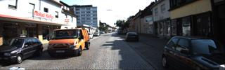

# KITTI Dataset
Multimodal dataset providing dense pointclouds from a lidar sensor as well as front-facing stereo images and GPS/IMU data.

<p align='center'>
  
</p>


## Load dataset
In order to the load the datasets, we provided the [`loader_kitti.py`](../../toolkit/loaders/loader_kitti.py)

```python
import os
from toolkit.loaders.loader_kitti import load_kitti
# fixme: replace OPENTRAJ_ROOT with the address to root folder of OpenTraj
kitti_root = 
traj_dataset = load_kitti(os.path.join(OPENTRAJ_ROOT, 'datasets/KITTI/data'), title='kitti', use_kalman=False, sampling_rate=1)
trajs = dataset.get_trajectories()
```

## License / Credits
> We thank Karlsruhe Institute of Technology (KIT) and Toyota Technological Institute at Chicago (TTI-C) for funding this project and Jan Cech (CTU) and Pablo Fernandez Alcantarilla (UoA) for providing initial results. We further thank our 3D object labeling task force for doing such a great job: Blasius Forreiter, Michael Ranjbar, Bernhard Schuster, Chen Guo, Arne Dersein, Judith Zinsser, Michael Kroeck, Jasmin Mueller, Bernd Glomb, Jana Scherbarth, Christoph Lohr, Dominik Wewers, Roman Ungefuk, Marvin Lossa, Linda Makni, Hans Christian Mueller, Georgi Kolev, Viet Duc Cao, Bünyamin Sener, Julia Krieg, Mohamed Chanchiri, Anika Stiller. Many thanks also to Qianli Liao (NYU) for helping us in getting the don't care regions of the object detection benchmark correct. Special thanks for providing the voice to our video go to Anja Geiger!

## Citation
```
@inproceedings{geiger2012we,
  title={Are we ready for autonomous driving? the kitti vision benchmark suite},
  author={Geiger, Andreas and Lenz, Philip and Urtasun, Raquel},
  booktitle={2012 IEEE Conference on Computer Vision and Pattern Recognition},
  pages={3354--3361},
  year={2012},
  organization={IEEE}
}
```
