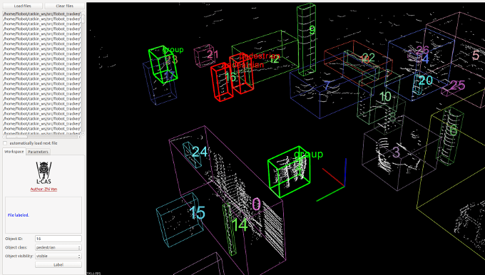

# L-CAS 3D Point Cloud People Dataset
This dataset contains 28,002 Velodyne scan frames, collected by the Velodyne VLP-16 3D LiDAR, in one of the main buildings (Minerva Building) of the University of Lincoln, UK. Total length of the recorded data is about 49 minutes. Data were grouped into two classes according to whether the robot was stationary or moving. 

<p align='center'>
   
</p>

For a quick overview, refer to the following video 

[](https://www.youtube.com/watch?v=eMdwPG8600k)

#### Contributions
This dataset provides:

1. Robot Operating System (ROS) rosbag files recording ground truth from the 3D LiDAR, robot odometry, ROS transform tree, as well as a panoramic camera.
2. Point Cloud Data (PCD) files corresponding to each scan frame, which is the official file format supported by the Point Cloud Library (PCL).
3. Annotation files in text format, including single-person (pedestrian) labels and human-group (group) labels.
4. A Qt-based GUI tool for data annotation, providing a semi-automatic labelling function, released as open-source.

Note: the panoramic image data can be provided only for research purposes according to Privacy Rule, please send us your request by email.


#### Recording platform
<p align='center'>
   
</p>

The Velodyne VLP-16 3D LiDAR was mounted at 0.8 m from the floor, on the top of a Pioneer 3-AT robot. It was set to rotate at 10 Hz (i.e. 600 revolutions per minute) with a maximum scan range of 100 m for the data recording, which can produce about 30,000 points per second. The robot navigation was controlled with a Logitech F710 gamepad at a maximum speed of 2.52 km/h, using the Pioneer robot ROS driver.


| Velodyne VLP-16 specifications |  |
| -- | -- |
| Scan channels: |	 	16 |
|Measurement range:	| 	up to 100 meters |
|Field of view (horizontal):	| 	360° |
| Field of view (vertical):	| 	30° (+15° to -15°) |


#### Challenges
A lot of challenges have been introduced in this dataset, such as human groups, children, people with luggage, people with trolleys, sitting people, and crowds of people.
<p align='center'>
   
</p>

## Downloads
The dataset contains the following files:

| CLASS | DATE | TIME | ROSBAG | PCD | ANNOTATION |
| ----- | ---- | ---- | ------ | --- | ---------- |
| Stationary | 2016/05/23 | 12:00-12:18 (19 minutes) | .bag | pcd.zip | labels.zip |
| Moving	    | 2016/05/23 | 12:27-12:38 (12 minutes) | .bag | pcd.zip |            |
| Stationary |	2016/05/23 | 12:39-12:56 (18 minutes) | .bag	| pcd.zip | labels.zip |
**[DATASET DOWNLOAD](https://lcas.lincoln.ac.uk/owncloud/index.php/s/KK14C3DZ0ouQx6I)**

## Annotation
People are labeled with 3D bounding boxes and marked as either visible or partially visible. Each pcd file’s annotation is contained in a text file named as the pcd but with extension .txt. Each line in the text file represents a label, which has eleven columns with various information:

| Column |     |
| ------ | --- |
| Column 1:	   |	category (pedestrian or group) |
| Column 2-4:  |	 	centroid (x-y-z)       |
| Column 5-7:  |	 	minimum bounds (x-y-z) |
| Column 8-10: |	 	maximum bounds (x-y-z) | 
| Column 11:	| 	visibility (0 = visible, 1 = partially visible)  |

A total of 5,492 frames (about 19.6% of the overall frames) has been annotated, which contains 6,140 single-person labels (“pedestrian”) and 3,054 human-group labels (“group”). The minimum and the maximum number of 3D points included in the single-person labels are 3 and 3,925 respectively, while the minimum and the maximum distance from the sensor to the single-person labels are 0.5 m and 27.0 m respectively.


#### Annotation tool
A Qt-based GUI tool has been developed to annotate the 3D point cloud data. The tool provides a semi-automatic annotation function, which means the 3D point cloud data (loaded from the pcd file) is first clustered to provide candidates for labelling, each candidate being a point cluster. Then, the user annotating the data, can label each object by indicating candidate’s ID, class, and visibility. (https://github.com/lcas/cloud_annotation_tool)

<p align='center'>
   
</p>

### Load Dataset with Toolkit
In order to the load the datasets, we provided the [`loader_lcas.py`](../../toolkit/loaders/loader_lcas.py)

```python
import os
from toolkit.loaders.loader_lcas import load_lcas
# fixme: replace OPENTRAJ_ROOT with the address to root folder of OpenTraj
lcas_root = os.path.join(OPENTRAJ_ROOT, 'datasets/L-CAS/data')
traj_datasets = load_lcas(lcas_root, title="L-CAS", use_kalman=False, sampling_rate=1)
```

## License
Creative Commons Licence
> This work is licensed under a [Creative Commons Attribution-NonCommercial-ShareAlike 4.0 International License](http://creativecommons.org/licenses/by-nc-sa/4.0/). Copyright (c) 2016 Zhi Yan, Tom Duckett, and Nicola Bellotto.


## Citation
```
@inproceedings{yz17iros,
   author = {Zhi Yan and Tom Duckett and Nicola Bellotto},
   title = {Online Learning for Human Classification in 3D LiDAR-based Tracking},
   booktitle = {In Proceedings of the 2017 IEEE/RSJ International Conference on Intelligent Robots and Systems (IROS)},
   address = {Vancouver, Canada},
   month = {September},
   year = {2017}
}
```
