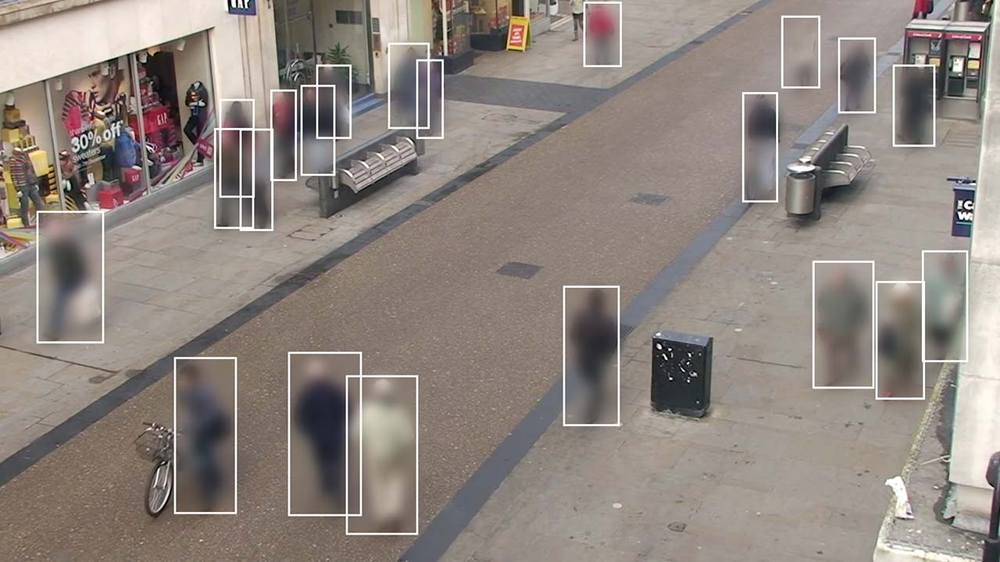

# Oxford Town Center Dataset
This dataset captures a pedestrian street with hundreds of people walking. The sequence was captured at 25 fps, and the total number of labeled frames is 4500. Thus, the total number of pedestrians is 230 from 71460 annotated ROIs.

<p align='center'>
  
</p>

## Annotation
Tracker Output file format
The ground truth and tracking output is provided in the `.top` file format. This consists of rows in comma-seperated variable (CSV) format:
```
personNumber, frameNumber, headValid, bodyValid, headLeft, headTop, headRight, headBottom, bodyLeft, bodyTop, bodyRight, bodyBottom

- personNumber - A unique identifier for the individual person
- frameNumber - The frame number (counted from 0)
- headValid - 1 if the head region is valid, 0 otherwise
- bodyValid - 1 if the body region is valid, 0 otherwise
- headLeft,headTop,headRight,headBottom - The head bounding box in pixels
- bodyLeft,bodyTop,bodyRight,bodyBottom - The body bounding box in pixels
```

### Load Dataset with Toolkit
In order to the load the datasets, we provided the [`loader_town.py`](../../toolkit/loaders/loader_town.py)

```python
import os
from toolkit.loaders.loader_town import load_town_center
# fixme: replace OPENTRAJ_ROOT with the address to root folder of OpenTraj
traj_ds = load_town_center(OPENTRAJ_ROOT + 'datasets/Town-Center/TownCentre-groundtruth-top.txt',
                           calib_path=OPENTRAJ_ROOT + 'datasets/Town-Center/TownCentre-calibration-ci.txt',
                           use_kalman=False, sampling_rate=10)

```

## License
No information is available.

## Citation
```
@inproceedings{benfold2011stable,
  title={Stable multi-target tracking in real-time surveillance video},
  author={Benfold, Ben and Reid, Ian},
  booktitle={CVPR 2011},
  pages={3457--3464},
  year={2011},
  organization={IEEE}
}
```
