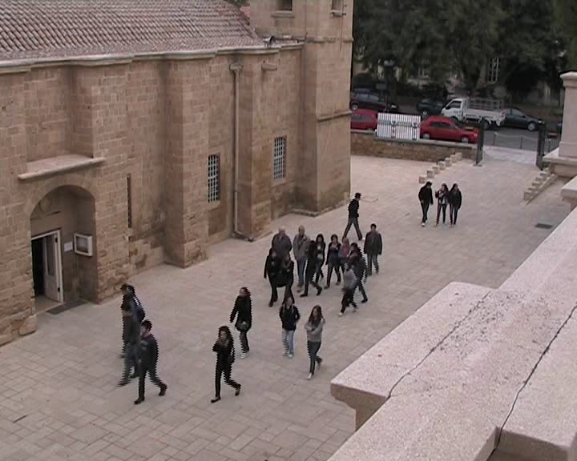
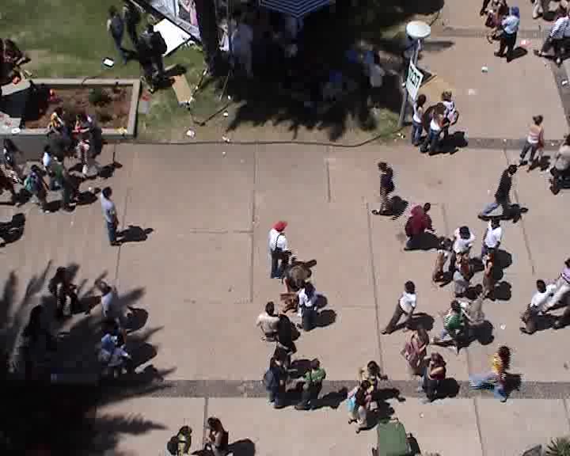

# UCY (Crowds-by-Example) Dataset

The [dataset](https://graphics.cs.ucy.ac.cy/research/downloads/crowd-data.html) contains annotated sequences from three different scenes: 
- Zara (zara01, zara02 and zara03)
- Arxiepiskopi
- University Students (students01, students03 and uni_examples)

<p align='center'>
  
  
  
</p>

* This dataset is extensively used in Human Trajectory Prediction literature.
* The videos are recorded with a frame rate of 25 frames per second.

## Annotations
The tracked file consists of a series of splines that describe the moving behavior of a person in a video.
Comments in the file start with a '-' and end at the end of the line.

The number of splines can be found in the first line of the file.
Then immediately after that, each spline is defined in the following format:

```
   Number_of_control_points_N
   x y frame_number gaze_direction   \
   x y frame_number gaze_direction    \
   ....                                >>> N control points
   x y frame_number gaze_direction    /
   x y frame_number gaze_direction   /

   Number_of_control_points_K
   x y frame_number gaze_direction   \
   x y frame_number gaze_direction    \
   ....                                >>> K control points
   x y frame_number gaze_direction    /
   x y frame_number gaze_direction   /
   
   ....
   ...
```   
- `x, y`: the position of the person in pixel space, where (0, 0) is the center of the frame.
- `frame_number`: the time (frames)at which the position was tracked
- `gaze_direction`: the viewing direction of the person in degrees (0 degrees means the person is looking upwards)


## Homography
Homography matrics are provided in H.txt files for zara[01,02,03], and students03.
You can use them to project the world-coord positions (or trajectories) on the reference images (or videos).

## Load Dataset with Toolkit
In order to the load the datasets, we provided the [`loader_crowds.py`](../../toolkit/loaders/loader_crowds.py)

```python
import os
from toolkit.loaders.loader_crowds import load_crowds
# fixme: replace OPENTRAJ_ROOT with the address to root folder of OpenTraj
zara01_annot = os.path.join(OPENTRAJ_ROOT, 'datasets/UCY/zara01/annotation.vsp')
zara01_H_file = os.path.join(OPENTRAJ_ROOT, 'datasets/UCY/zara01/H.txt')
traj_dataset = load_crowds(zara01_annot, use_kalman=False, homog_file=zara01_H_file)
```
* **Note**: The loader interpolates the annotated frames using linear interpolation. The framerate of annotations are then 2.5 fps (every 10 frames).

## License
Disclaimer by authors: 
- **These data is free for use, as long as the authors give credit to the original uploaders.**

## Citation
```
@inproceedings{lerner2007crowds,
  title={Crowds by example},
  author={Lerner, Alon and Chrysanthou, Yiorgos and Lischinski, Dani},
  booktitle={Computer graphics forum},
  volume={26},
  number={3},
  pages={655--664},
  year={2007},
  organization={Wiley Online Library}
}
```
