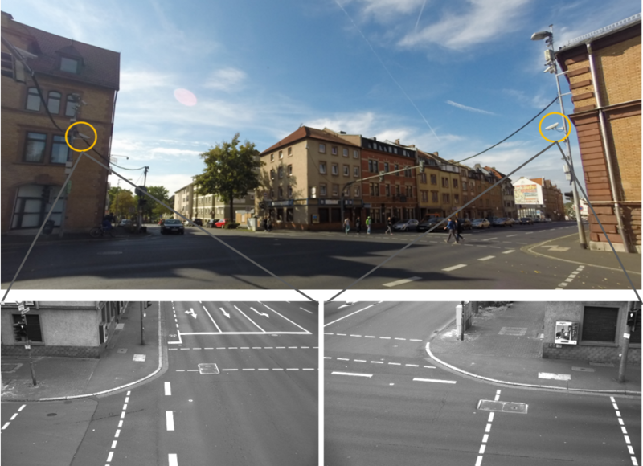

# VRU Trajectory Dataset

The [VRU Trajectory Dataset](https://www.th-ab.de/ueber-uns/organisation/labor/kooperative-automatisierte-verkehrssysteme/trajectory-dataset/) consists of 1068 pedestrian and 464 cyclist trajectories recorded at an urban intersection using cameras and LiDARs. A detailed description of the intersection can be found in [1].
The pedestrian trajectories were recorded by using a wide angle stereo camera system to track the pedestrians' head position and generating the 3D position by triangulation. The cyclists trajectories were recorded by using LiDARs to track the center of gravity of the cyclists. The cameras operate at 50 Hz, the LiDARs at 12.5 Hz. 
The dataset partly results from the projects DeCoInt² [2] funded by the "German Reasearch Foundation" (DFG) and AFUSS funded by the "Bundesministerium für Bildung und Forschung" (BMBF). Additionally, our work is supported by "Zentrum Digitalisierung Bayern".

* Overview of the research intersection with view from wide angle stereo camera images:
<p align='center'>
  
</p>


## Download
The trajectories can be downloaded as complete dataset containing pedestrian and cyclsist trajectories or seperatly:

- [complete dataset](https://www.th-ab.de/fileadmin/dokumente/labore/RSE_MT/VRUTrajectoryDataset/VRUT_Dataset_complete.tar.gz)
- [pedestrians](https://www.th-ab.de/fileadmin/dokumente/labore/RSE_MT/VRUTrajectoryDataset/pedestrians.tar.gz)
- [cyclists](https://www.th-ab.de/fileadmin/dokumente/labore/RSE_MT/VRUTrajectoryDataset/cyclists.tar.gz)

## Annotation

The complete dataset consists of 1532 files in csv format, where every file contains one VRU trajectory. A csv file consists of 4 columns:

```
- ID: Measurement IDs
- timestamp: Timestamp in seconds
- x: position in x-direction in meter
- y: position in y-direction in meter
```

* Trajectories of pedestrians (left) and cyclists (right) plotted to map of intersection:
<p align='center'>
  
</p>

* **Note**: Due to privacy laws, we are not able to publish image data.

### Load Dataset with Toolkit
The loader is not implemented yet :(

## License
No information is available.

## Citation
```
@MISC{VRUDataset,
  author = {},
  title = {{VRU} {T}rajectory {D}ataset},
  note = {\url{https://www.th-ab.de/vru-trajectory-dataset}},
}
```
