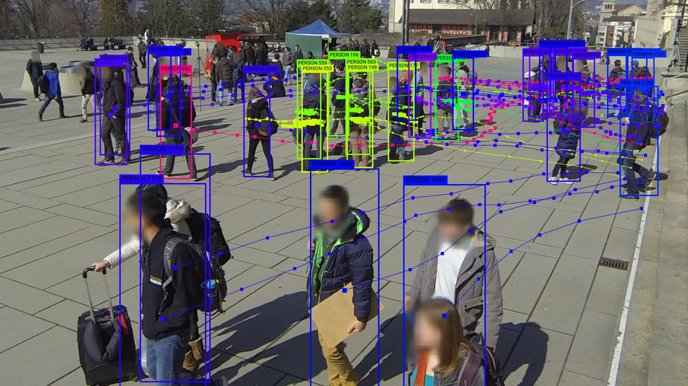

# Wildtrack Dataset

The challenging and realistic setup of the **WILDTRACK** dataset brings multi-camera detection and tracking methods into the wild.
It meets the need of the deep learning methods for a large-scale multi-camera dataset of walking pedestrians, where the cameras’ fields of view in large part overlap. Being acquired by current high tech hardware it provides HD resolution data. Further, its high precision joint calibration and synchronization shall allow for development of new algorithms that go beyond what is possible with currently available data-sets.

<p align='center'>
  
</p>

## Download

#### Annotated dataset (frames & annotations):
[Wildtrack_dataset_full.zip](http://documents.epfl.ch/groups/c/cv/cvlab-unit/www/data/Wildtrack/Wildtrack_dataset_full.zip)

#### Videos:
- Camera 1: https://drive.google.com/open?id=1sGUnExmJM2_tFuBd9LNlexf0LN2m0_c-
- Camera 2: https://drive.google.com/open?id=1OnaRN2qYhZ2n4rSaNZQJzQPd1Cl2fluk
- Camera 3: https://drive.google.com/open?id=1I7ARLVVfZqdZTbYG_TPEfDt1Bc8N35Lb
- Camera 4: https://drive.google.com/open?id=1sXn70X-bV_YGPv43r4-iMtK_Js09eUVB
- Camera 5: https://drive.google.com/open?id=1ExTyezMWqmLefi2kJTQwYxZivJuag7G5
- Camera 6: https://drive.google.com/open?id=1NM4kNjdyiC6JioOT90s9vFmMUkeSnV0z
- Camera 7: https://drive.google.com/open?id=1pZ3pWBuaLgPWGfOcY-tAtsBAUyQZW_YX

## Annotations:
Frame annotations are in the folder “annotations_positions”.
Corresponding images from 7 cameras are in the folder “Image_subsets”.

In order to recover the 3D location of the target, you have to use the following information.

The “positionID” in .json files are indexed on a 480x1440 grid, X-first, with a 2.5cm spacing. The origin is (-3.0,-9.0)
Therefore,
```python
X = -3.0 + 0.025 * ID%480
Y = -9.0 + 0.025 * ID/480
```

- The file `rectangles.pom` gives correspondence between rectangle IDs and 2D bounding boxes on each camera.
- This files is needed to run algorithms such as: https://github.com/pierrebaque/DeepOcclusion
- It can be reproduced using: https://github.com/pierrebaque/generatePOMfile

## Camera calibrations

You will find camera calibrations in the folder “calibrations”.
“extrinsic” contains extrinsic camera calibrations
“intrinsic_zero” contains intrinsic calibrations for the images which have been undistorted. These are the ones which should be used for the images provided in this dataset.
“intrinsic_original” contains calibrations for the original images and the original video, which we can provide if you ask.


## Load Dataset with Toolkit
In order to the load the datasets, we provided the [`loader_wildtrack.py`](../../toolkit/loaders/loader_wildtrack.py)

```python
import os
from toolkit.loaders.loader_wildtrack import load_wildtrack
# fixme: replace OPENTRAJ_ROOT with the address to root folder of OpenTraj
wildtrack_root = os.path.join(OPENTRAJ_ROOT, 'datasets/Wild-Track/annotations_positions')
traj_datasets = load_wildtrack(wildtrack_root, title='WildTrack', use_kalman=False, sampling_rate=1) 
```

## License
No information is available.

## Citation
https://arxiv.org/pdf/1707.09299.pdf
```
@article{chavdarova2017wildtrack,
  title={The Wildtrack Multi-Camera Person Dataset},
  author={Chavdarova, Tatjana and Baqu{\'e}, Pierre and Bouquet, St{\'e}phane and Maksai, Andrii and Jose, Cijo and Lettry, Louis and Fua, Pascal and Van Gool, Luc and Fleuret, Fran{\c{c}}ois},
  journal={arXiv preprint arXiv:1707.09299},
  year={2017}
}
```
